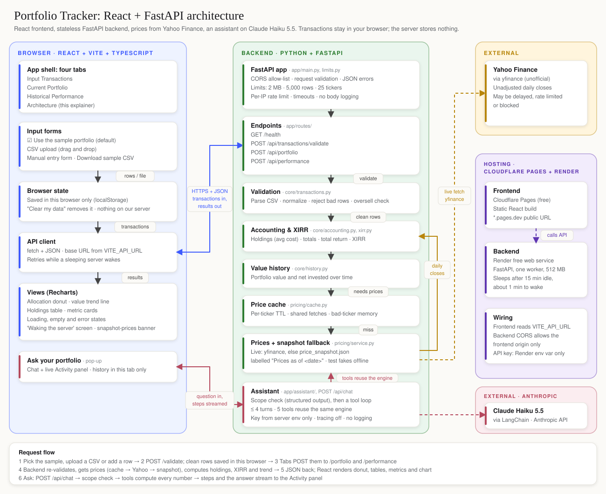

# Portfolio Tracker

A read-only stock portfolio tracker with an AI assistant. Upload your buy and sell trades (or use the made-up sample) and see holdings, returns and XIRR in a clean dashboard.

**Live app: https://portfolio-tracker-react.pages.dev**

Built with Claude Code for the Maven "Mastering Agentic AI" (Gen Academy) Week 1 project.

## What it does

| Tab | What you see |
| --- | --- |
| Current Portfolio | Current value, allocation donut, holdings with gain/loss and weight |
| Historical Performance | Total invested, total return, XIRR, value vs net invested over time |
| Input Transactions | Sample portfolio, CSV drag-and-drop or manual entry, all validated |
| Architecture | How the app is built, with a zoomable diagram |

**Ask your portfolio.** The round "Ask" button opens a chat about the loaded portfolio:

- It answers questions like "What's my XIRR?" or "What if I sell 2 AAPL?"
- Every number comes from the same tested code as the dashboards; the model never does arithmetic.
- It explains, but never recommends buying or selling. Off-topic questions are politely declined.

## How it works



- **Frontend:** React 19, Vite, TypeScript, Recharts, on Cloudflare Pages
- **Backend:** Python 3.12 FastAPI (uv), on Render's free tier (the first visit after 15 idle minutes takes about a minute to wake)
- **Prices:** Yahoo Finance daily closes, cached, with a clearly labelled stored-price fallback
- **Assistant:** Claude Haiku 5.5 through LangChain, with five portfolio tools and a scope check

## Privacy and safety

- Your trades are saved in your browser only. "Clear my data" removes them. The server stores nothing.
- The API key lives only on the server. CSV text is treated as data, never as instructions.
- Logs hold counts and timings only, never questions, answers or holdings. Assistant spend is capped at $5/month.

## Run it locally

Needs [uv](https://docs.astral.sh/uv/) and Node 20+. Two terminals:

```powershell
cd backend; uv sync; uv run uvicorn app.main:app --reload
```

```powershell
cd frontend; npm install; npm run dev
```

Then open http://localhost:5173. Tests: `cd backend; uv run pytest` (129, offline). The assistant needs `ANTHROPIC_API_KEY` in the backend's environment; the rest works without it.

## Docs

| Doc | What's in it |
| --- | --- |
| [Developer guide](docs/DEVELOPMENT.md) | Settings, tests, monitoring, price snapshot, deploy |
| [Spec](docs/SPEC.md) | Every product and design decision |
| [Status](docs/STATUS.md) | Where things stand, timeline, results |
| [QA checklist](docs/QA_CHECKLIST.md) | Manual checks before a release |
| [Deploy notes](docs/DEPLOY.md) | Cloudflare Pages and Render setup |
| [Build prompt](docs/PROMPT.md) | The one prompt that sums up the build |
| [Sample CSVs](samples/README.md) | Made-up files for testing uploads |
| [AGENTS.md](AGENTS.md) | Rules for AI coding agents in this repo |

## Limits

USD only; splits, dividends and non-US tickers are ignored; daily closing prices. Use sample or made-up data.

Built by [Shashank Patel](https://www.linkedin.com/in/shashank-patel/). Read-only demo. Not investment advice.
